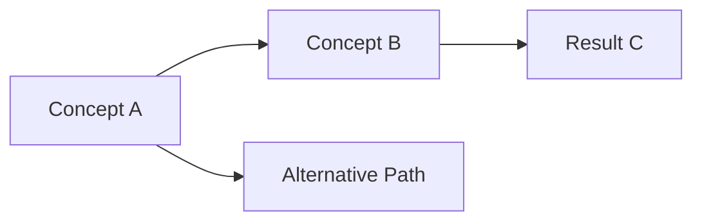

<!--
TEMPLATE FOR STUDY NOTES
========================

Copy this file to create new study posts. Replace:
1. Filename: YYYY-MM-DD-descriptive-title.md
2. Front matter fields (title, date, categories, tags)
3. All content sections below
4. Delete this comment block

FRONT MATTER GUIDE:
- title: Chapter or topic title in quotes
- date: YYYY-MM-DD HH:MM:SS -0500 (use your timezone)
- categories: [Topic, Subtopic] - exactly 2 levels, capitalize each word
  * Common: [Machine Learning, Statistics], [Machine Learning, Deep Learning]
- tags: lowercase, hyphenated (e.g., neural-networks, black-scholes, probability-theory)
- math: true (enables LaTeX math rendering)
- mermaid: true (enables diagrams, optional)
- pin: true (pins to top of home page, optional)
-->

## Overview

Brief 2-3 sentence summary of what this chapter/section covers. What are the main learning objectives?

---

## Key Concepts & Definitions

### Concept 1: Name

Clear explanation of the concept.

**Formal Definition:**
> Mathematical or precise definition goes here, using blockquotes for emphasis.

**Intuition:**
Explain what this means in plain language or with an analogy.

### Concept 2: Another Important Idea

Continue with other key concepts...

---

## Theorems & Important Results

### Theorem Name (e.g., Bayes' Theorem)

**Statement:**

$$
P(A|B) = \frac{P(B|A)P(A)}{P(B)}
$$

**Proof:** *(optional)*

1. Start with the definition of conditional probability
2. Apply algebraic manipulation
3. Arrive at the result ∎

**Intuition:**
What does this theorem tell us? When is it useful?

**Applications:**
- Where this theorem is commonly used
- Example domains or problems

---

## Mathematical Derivations

Show important derivations step-by-step:

Starting from the basic assumption:

$$
f(x) = ...
$$

Apply technique/transformation:

$$
g(x) = ...
$$

Final result:

$$
h(x) = ...
$$

---

## Examples & Problem Solutions

### Example 1: Problem Title

**Problem Statement:**

Clearly state the problem to be solved.

**Given:**
- Parameter 1: value
- Parameter 2: value

**Find:** What we're looking for

**Solution:**

**Step 1:** Initial setup

Explain the approach and show the math.

**Step 2:** Apply relevant theorem

$$
result = calculation
$$

**Step 3:** Simplify and interpret

**Answer:** $final\_result$

**Key Takeaway:**
What makes this problem important or what technique did we learn?

### Example 2: Another Problem

*(Follow same structure)*

---

## Code Implementation

```python
import numpy as np

def example_function(x):
    """
    Brief description of what this code demonstrates.

    Args:
        x: input description

    Returns:
        output description
    """
    result = x ** 2
    return result

# Example usage
print(example_function(5))
```

**Output:**
```
25
```

**Explanation:**
What does this code illustrate from the chapter?

---

## Diagrams & Visualizations



*Description of what the diagram shows and why it's helpful*

---

## Personal Insights & Commentary

### Connections to Previous Material

- How this chapter relates to Chapter X
- Links to other concepts or books

### Confusing Points & Clarifications

- What was initially confusing
- How I understood it after working through examples
- Common pitfalls to avoid

### Practical Applications

- Real-world use cases
- Why this matters beyond the textbook

### Open Questions

- Things to explore further
- Related topics to study next

---

## Practice Problems

### Problem 1

From textbook page XXX, exercise Y.Z

### Problem 2

Self-generated problem to test understanding:

*State the problem*

---

## Summary & Key Takeaways

Quick bullet-point recap:

1. **Main Concept 1**: One-sentence summary
2. **Main Concept 2**: One-sentence summary
3. **Important Formula**: $key\_equation$
4. **Practical Insight**: Why this matters

---

## References & Further Reading

### Primary Source
- **Book:** *Book Title* by Author Name, Chapter X
- **Pages:** pp. XXX-YYY

### Supplementary Resources
- [Video Lecture Title](URL) - Brief description
- [Blog Post/Article](URL) - What it covers
- [Related Paper](URL) - Why it's relevant

### Related Chapters
- Previous: [Chapter X-1 Title](link)
- Next: [Chapter X+1 Title](link)
- See also: [Related Topic](link)

---

## Revision History

- **2025-01-01**: Initial notes created
- **2025-01-05**: Added practice problem solutions
- **2025-01-10**: Clarified proof of Theorem X

> This post will be updated as I work through problems and gain deeper understanding.
{: .prompt-info }
