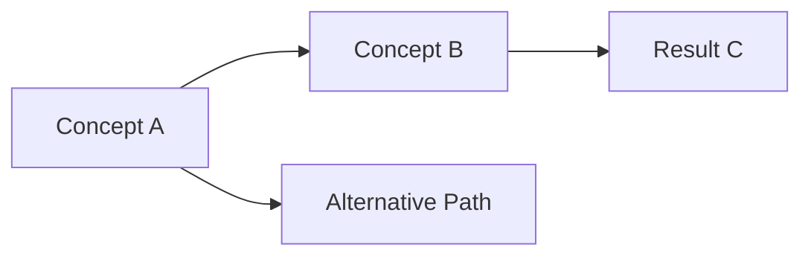

# Overview

This chapter covers the basics of linear algebra, starting with vectors and matrices, system of linear equations, matrix inverse, and Gaussian elimination. Then moving on to linear independence and basis, and finally vector spaces, groups, and linear/affine mappings.

---

## Key Concepts & Definitions

### Vector and Matrices

$$
a_{11} \cdot x_{11} + \ldots + a_{1n} \cdot x_{1n} = b_1 \\
\vdots \\
a_{m1} \cdot x_{m1} + \ldots + a_{mn} \cdot x_{mn} = b_m
$$

is the general form of a _system of linear equations_, $x_1, ...,x_n$ are the unknowns.

**Intuition:**
For a system of linear equations with two variables $x_1, x_2$, each linear equation defines a line on the $x_1,x_2$-plane. The solution set is the intersection of these lines. The solution can be:

* a line if the linear equations describe the same line
* a point if the linear equations are different lines
* empty if the linear equations are parallel

**Example**:

$$
4x_1 + 4x_2 = 5 \\
2x_1 - 4x_2 = 1 \\
$$

By adding (1) and (2):

$$
6x_1 = 6 \\
x_1 = 1
$$

and by substitution:

$$
x_2 = \frac{1}{4}
$$

The solution set for this sample is a single point located at $(1,\frac{1}{4})$.

**Matrix**:
With $ m,n \in \mathbb{N}$ a real-valued $(m, n)$ _matrix **A**_ is an $m \times n$-tuple of elements $a_{ij}, i = 1,...,m, j = 1,...n$ which is ordered according to a rectangular scheme consisting of $m$ rows and $n$ columns:

$$
A = \begin{bmatrix}
a_{11} & a_{12} & \cdots & a_{1n} \\
a_{21} & a_{22} & \cdots & a_{2n} \\
\vdots & \vdots & \ddots & \vdots \\
a_{m1} & a_{m2} & \cdots & a_{mn}
\end{bmatrix}
$$

Addition of matrices is done element wise:

$$

A+B
=
\begin{bmatrix}
a_{11} + b_{11} & \cdots & a_{1n} + b_{1n} \\
\vdots & \ddots & \vdots \\
a_{m1} + b_{m1} & \cdots & a_{mn} + b_{mn}
\end{bmatrix}
$$

The product of $A \in \mathbb{R}^{m \times n}$ and $B \in \mathbb{R}^{n \times k}$ elements $c_{ij}$ of product $C = AB \in \mathbb{R}^{m \times k}$ are computed as

$$
c_{ij} = \sum{a_{il} b_{lj}}, i = 1,...,m, j=1.,,,.k
$$

In simpler terms this is rows times columns elementwise. So the first row of the $A$ matrix is multiplied element wise by the first column of the $B$ matrix to get the value of $C_{1,v1}$.

**NOTE**: Matrix multiplication is not defined as element-wise operation on matrix elements, $c_{ij} \ne a_{ij}b_{ij}$. This is called the _Hadamard product_ and is often used in programming languages when we multiply multi-dimensional arrays.

**Identity Matrix**:

In $\mathbb{R}^{n \times n}$, the _identity matrix_ has only 1s in the diagonals.

**Properties of Matrices:**

* _Associativity_: $(AB)C = A(BC)$, ie the order of multiplication does not matter as long as multiplication can be done based on the size of the respective matrices

* _Distributivity_: $(A + B)C = AC + BC$

* _Multiplication w/ Identity_: $\forall A \in \mathbb{R}^{m \times n}: I_mA = AI_n = A$, ie multiplying by the identity matrix does not change the matrix


### Vector Space

Continue with other key concepts...

### Linear Independence and Basis

### Linear / Affine Mapping

---

## Theorems & Important Results

### Theorem Name (e.g., Bayes' Theorem)

**Statement:**

$$
P(A|B) = \frac{P(B|A)P(A)}{P(B)}
$$

**Proof:** *(optional)*

1. Start with the definition of conditional probability
2. Apply algebraic manipulation
3. Arrive at the result ∎

**Intuition:**
What does this theorem tell us? When is it useful?

**Applications:**
- Where this theorem is commonly used
- Example domains or problems

---

## Mathematical Derivations

Show important derivations step-by-step:

Starting from the basic assumption:

$$
f(x) = ...
$$

Apply technique/transformation:

$$
g(x) = ...
$$

Final result:

$$
h(x) = ...
$$

---

## Examples & Problem Solutions

### Example 1: Problem Title

**Problem Statement:**

Clearly state the problem to be solved.

**Given:**
- Parameter 1: value
- Parameter 2: value

**Find:** What we're looking for

**Solution:**

**Step 1:** Initial setup

Explain the approach and show the math.

**Step 2:** Apply relevant theorem

$$
result = calculation
$$

**Step 3:** Simplify and interpret

**Answer:** $final\_result$

**Key Takeaway:**
What makes this problem important or what technique did we learn?

### Example 2: Another Problem

*(Follow same structure)*

---

## Code Implementation

```python
import numpy as np

def example_function(x):
    """
    Brief description of what this code demonstrates.

    Args:
        x: input description

    Returns:
        output description
    """
    result = x ** 2
    return result

# Example usage
print(example_function(5))
```

**Output:**
```
25
```

**Explanation:**
What does this code illustrate from the chapter?

---

## Diagrams & Visualizations



*Description of what the diagram shows and why it's helpful*

---

## Personal Insights & Commentary

### Connections to Previous Material

- How this chapter relates to Chapter X
- Links to other concepts or books

### Confusing Points & Clarifications

- What was initially confusing
- How I understood it after working through examples
- Common pitfalls to avoid

### Practical Applications

- Real-world use cases
- Why this matters beyond the textbook

### Open Questions

- Things to explore further
- Related topics to study next

---

## Practice Problems

### Problem 1

From textbook page XXX, exercise Y.Z

### Problem 2

Self-generated problem to test understanding:

*State the problem*

---

## Summary & Key Takeaways

Quick bullet-point recap:

1. **Main Concept 1**: One-sentence summary
2. **Main Concept 2**: One-sentence summary
3. **Important Formula**: $key\_equation$
4. **Practical Insight**: Why this matters

---

## References & Further Reading

### Primary Source
- **Book:** [*Mathematics for Machine Learning*](https://mml-book.github.io/)
- **Chapter:** 2

### Supplementary Resources
- [Video Lecture Title](URL) - Brief description
- [Blog Post/Article](URL) - What it covers
- [Related Paper](URL) - Why it's relevant

### Related Chapters
- Next: [Chapter 3 Analytic Geometry](link)

---

## Revision History

- **2025-01-01**: Initial notes created

> This post will be updated as I work through problems and gain deeper understanding.
